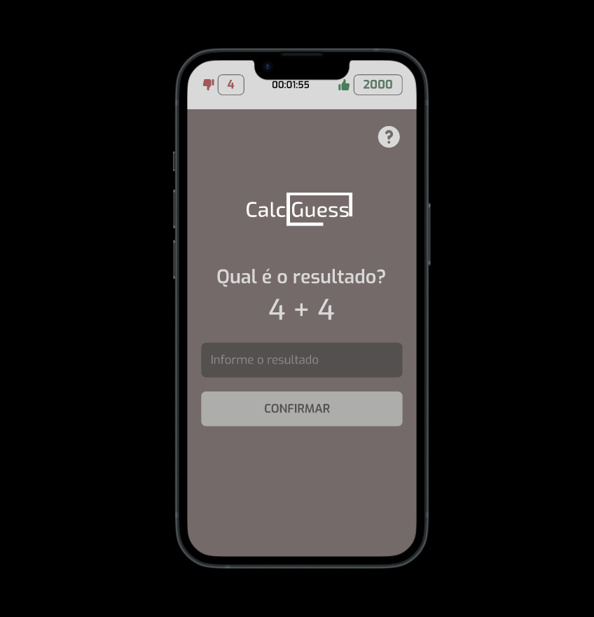

# Calc Challenge

<p>
  Este app mobile é de uma calculadora, aonde o usuário pode treinar a tabuada. ela gera desafios de cálculo aleatório e acrescenta pontos positivos caso acerte e negativos caso erre no resultado.
</p>
<center>
  
</center>

## Tecnologias

- React Native
- Expo
- Typescript

## 🚀 Como usar

- Clone o repositório

`git clone https://github.com/samuelfreitas-ao/calc-challenge-app.git`

- Instale as dependências do projecto

```java
npm install
```

- Execute o projecto

```java
npm run start
```

## Layout do projecto

- [Aceder layout do projecto](https://www.figma.com/file/XfpDaTpOYz9CcCWmNnQ0cs/Calc-Challenge?node-id=0%3A1&t=9aXlaxuU12LW8IkH-1)

## Baixe o aplicativo e instale no seu android

- [Baixar o apk](https://www.mediafire.com/file/k0wt53qvoliaa30/Calc_Challenge.apk/file)

## Assista o vídeo de apresentação do app

- [Assistir apresentação](https://youtu.be/IvNon73dEjU)
